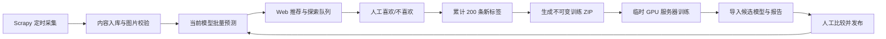

# 个人偏好内容筛选与持续学习平台开发计划

## 1. 目标与边界

构建一个局域网内可由手机和电脑访问的个人内容筛选平台：爬虫持续采集，当前模型为内容打分，Web 端展示缩略图和链接供人工“喜欢/不喜欢”筛选；每累计 200 条新增明确标签后自动生成训练包，由用户手动上传到临时 GPU 服务器训练，导回候选模型后人工决定是否发布。



关键原则：

- 模型只用于排序、初筛和辅助标注，不能直接生成训练真值。
- 只有明确的“喜欢/不喜欢”作为训练标签；跳过、浏览、点击链接只记录行为统计。
- 模型不能自动替换线上版本；候选版本必须人工发布。
- 所有标签、数据快照、模型、阈值和评估指标必须可追溯与可回滚。
- 现有训练集和爬虫图片保留原地，平台只保存经校验的路径引用和自身缩略图缓存。

## 2. 技术架构与仓库职责

### 常驻 Windows 平台

- 前端：React、TypeScript、Vite、React Router、TanStack Query、Tailwind CSS。
- 后端：FastAPI、Pydantic、SQLAlchemy 2、Alembic。
- 数据库：SQLite，启用 WAL、外键和 busy timeout。
- 异步任务：独立 Python worker，通过数据库任务表领取任务；第一版不引入 Redis/Celery。
- 文件：原始图片保持在现有数据集/爬虫目录；平台管理缩略图缓存、模型、训练包、候选包、日志和备份。
- 访问：FastAPI 同源托管前端构建产物，局域网通过 `http://主机IP:8080` 访问。

### 两仓库职责

- `caoliuSpider`：采集、稳定去重、下载和校验图片，调用平台入库 API；不负责标签、训练或模型发布。
- `caoliu_deeplearning`：保留模型训练/预测代码，并新增平台后端、worker、前端、数据库迁移、训练包和模型管理能力。

## 3. 数据模型

### 核心表

| 表 | 关键字段与用途 |
| --- | --- |
| `users` | 单管理员账户，保存用户名、Argon2 密码哈希、状态和登录时间。 |
| `content_items` | 内容 UUID、稳定 `content_key`、来源 URL、原始/清洗标题、磁力链接、infohash、状态、当前标签、内容组。 |
| `media_assets` | 内容关联的原图路径、缩略图路径、序号、格式、尺寸、哈希、状态。 |
| `label_events` | 不可变人工标签事件；每次改标新增事件而不覆盖旧记录。 |
| `view_events` | 浏览、跳过、复制/打开链接等行为统计，不进入训练集。 |
| `predictions` | 内容、模型版本、概率、阈值、预测标签、时间。 |
| `model_versions` | candidate/active/archived/rejected 状态、文件哈希、指标、数据版本、阈值、温度。 |
| `training_snapshots` | 训练快照、标签截止时间、样本统计、manifest 哈希、训练包路径和状态。 |
| `jobs` | predict、export_package、generate_thumbnail、reconcile_media 等后台任务。 |
| `crawl_runs` | 每次爬虫运行的页数、发现/去重/下载成功失败数量和日志摘要。 |

### 内容唯一性和分组

1. 有 BT infohash 时，`content_key` 使用小写 infohash。
2. 没有 infohash 时，使用规范化帖子 URL 的 SHA-256。
3. 相同 `content_key` 再次采集只更新可变元数据，不创建新内容。
4. `content_group_id` 用于训练切分；相同 infohash、下载链接或规范化标题属于同组，永不跨 split。

### 标签与行为

- `label_events.label` 仅为 `0` 或 `1`，来源固定为 `explicit_web`。
- 修改标签时写入新事件及 `supersedes_event_id`；`content_items.current_label` 缓存最新值。
- `skip` 只生成行为事件，设置 7 天推荐冷却期，不产生负标签。
- 每个标签事件记录当时模型版本和概率，供后续分析模型误导情况。

## 4. 爬虫改造

### 流程

1. 列表页提取帖子 URL 和列表标题。
2. 详情页保留 `title_raw`，再生成 `title_clean`。
3. 提取磁力链接和标准化 infohash。
4. 收集图片候选，过滤广告、头像、表情和重复 URL。
5. 生成稳定 `content_key`，不再依赖递增 `video_01` 编号。
6. 下载最多 5 张有效图片。
7. 下载完成并验证至少一张有效图片后，调用平台入库 API。
8. 后端返回内容 ID，爬虫记录入库/去重结果。

### 图片质量与安全

- 图片最小尺寸为 `224×224`；必须可由 Pillow 解码。
- 过滤零字节、超小文件和极端长宽比图片。
- 用 SHA-256 删除完全相同图片；GIF 生成第一帧缩略图。
- 恢复全局 OffsiteMiddleware；媒体请求使用显式 `allow_offsite`。
- 没有有效图片的内容进入失败记录，不能进入正式队列。

### 调度

- Windows Task Scheduler 每 30 分钟运行一次增量抓取，默认扫描最新 4 页。
- 开启 AutoThrottle，单域并发 1。
- 每次运行幂等，重复执行不会重复入库。
- 连续失败仅记录和退避，不无限快速重试。

### 爬虫入库 API

`POST /api/v1/ingest/content` 接收：

- `content_key`、`source_url`、`title_raw`、`title_clean`
- `magnet_uri`、`info_hash`、`crawl_time`
- `media_paths`

后端校验 API key、内容键、允许媒体根目录、图片存在性、图片元数据和重复状态。成功入库后返回 `content_id`、`created`、`duplicate` 和 `prediction_job_id`。

## 5. 推理服务与推荐队列

### 推理 worker

- worker 启动时加载数据库中 active 模型，模型常驻内存。
- 每 5 秒领取最多 32 条预测任务，使用真正张量批处理。
- 保存校准概率、阈值、预测标签、模型版本、耗时和失败原因。
- 新模型发布后当前批次结束再热加载；加载失败时保留旧模型并记录告警。
- 没有 active 模型时内容仍可浏览，但显示“待预测”。

### 默认待筛选队列

每批 20 条未明确标注内容：

- 16 条高分推荐。
- 2 条最接近当前阈值的不确定内容。
- 2 条从其他未标注分数区间随机抽取的探索内容。

已标注内容排除；跳过内容在 7 天内排除；同一内容组只出现一次。支持高分、最不确定、最新、纯随机四种模式，分页使用 cursor。

## 6. Web 前端

### 路由

- `/login`：单管理员登录。
- `/review`：待筛选队列。
- `/library`：内容库与筛选。
- `/labels`：标签历史与统计。
- `/training`：训练快照、候选模型和发布。
- `/models`：模型版本、评估和回滚。
- `/crawler`：抓取状态、日志和手动执行。
- `/settings`：根目录、爬虫、推荐、备份和安全设置。

### 待筛选页

- 响应式卡片/专注模式，支持 1～5 张图片轮播。
- 显示标题、来源时间、模型概率、阈值、模型版本，以及打开来源、复制/打开磁力链接操作。
- 桌面快捷键：`1` 喜欢、`2` 不喜欢、`3` 跳过、`←/→` 切换图片、`M` 复制磁力、`Z` 撤销。
- 移动端使用底部固定按钮；滑动只切图，不直接标注，避免误触。
- 提交后立即显示下一条，并提供撤销提示。

### 内容库和统计

- 按标签、分数、模型版本、来源、抓取时间、查看状态筛选。
- 支持查看全部、喜欢、不喜欢、未标注、跳过冷却、媒体缺失和归档内容。
- 修改标签显示完整历史事件和所有模型预测历史。
- 标注页展示正负比例、新增标签数、高置信误判、阈值附近样本、模型纠正率。

### 训练与模型页面

- 显示距离下一训练包还差多少明确标签。
- 展示每个训练包的样本数、类别比例、重复/缺失过滤数、manifest 哈希和下载按钮。
- 支持上传候选模型包、对比 active/candidate 指标、查看错误集合、发布、拒绝和回滚。
- 训练图必须正确显示 PR-AUC，不能再将其错误标成 Validation Accuracy。

## 7. 后端公开接口

### 鉴权

- `POST /api/v1/auth/login`
- `POST /api/v1/auth/logout`
- `GET /api/v1/auth/session`

### 内容、推荐与媒体

- `GET /api/v1/feed?mode=mixed&limit=20&cursor=...`
- `GET /api/v1/contents`
- `GET /api/v1/contents/{id}`
- `GET /api/v1/contents/{id}/media/{media_id}`
- `POST /api/v1/contents/{id}/archive`

### 标签和事件

- `POST /api/v1/contents/{id}/label`，请求 `{ "label": 0|1 }`
- `POST /api/v1/contents/{id}/skip`
- `POST /api/v1/contents/{id}/events`
- `POST /api/v1/labels/{event_id}/undo`
- `GET /api/v1/labels/history`

所有写接口支持 idempotency key，防止多设备或弱网络重复提交。

### 训练、模型与任务

- `GET/POST /api/v1/training/snapshots`
- `GET /api/v1/training/snapshots/{id}/download`
- `POST /api/v1/training/candidates/import`
- `GET /api/v1/training/candidates/{id}/comparison`
- `GET /api/v1/models`
- `POST /api/v1/models/{id}/activate`
- `POST /api/v1/models/{id}/reject`
- `POST /api/v1/models/{id}/rollback`
- `GET /api/v1/crawls`
- `POST /api/v1/crawls/run`
- `GET /api/v1/jobs`
- `POST /api/v1/jobs/{id}/retry`

现有单条、批量、上传和 URL 预测接口保留兼容，但统一到 `/api/v1/predict` 前缀并增加鉴权。

## 8. 训练快照与临时 GPU 服务器

### Split 规则

- 现有数据集3永久作为固定外部测试集。
- 新 Web 明确标签首次写入时按 `content_group_id` 哈希固定分配：80% train、10% validation、10% production shadow test。
- 同一内容组永远属于同一 split。
- 阈值与温度只能在 validation 上选择；固定测试和 shadow test 只用于最终报告。

### 自动快照

- 从上一次已发布模型后累计 200 条新增明确标签时，自动创建不可变训练快照。
- 快照创建后新增标签进入下一批；可手动重新生成新快照，但旧快照不覆盖。
- ZIP 包总是包含完整有效训练数据，不只是新增 200 条。

训练包命名：`training_snapshot_<snapshot_id>_<manifest_hash>.zip`。

内容：

```text
manifest.csv
split_manifest.csv
config.json
images/
README_TRAINING.md
SHA256SUMS.json
```

远程训练脚本需支持 `--package`、`--run-id`、`--output-dir` 和传入 split 清单，禁止远端重新随机切分。

### 候选模型包

候选包命名：`candidate_<run_id>.zip`，包含：

- `best_model.pth`
- `evaluation_report.json`
- `training_history.json`、`training_history.png`
- 验证集/外部测试集预测与错误集合 CSV
- `model_manifest.json`
- `SHA256SUMS.json`

导入时检查内部哈希、checkpoint 格式、数据/测试 manifest 哈希、必需指标、模型安全加载和一次推理烟雾测试。

### 发布规则

硬性阻止发布：包损坏、模型不能加载、测试集哈希不一致、缺少报告、NaN/Inf 输出、推理失败。

软警告但允许人工覆盖：候选 PR-AUC 比 active 低超过 `0.02`、precision/recall 明显下降、未达到 90% precision、Brier score 变差、固定测试和 shadow test 趋势相反。

发布时事务切换 active 模型，worker 热加载；失败自动保持/回滚旧模型。旧预测保留，新内容使用新模型，未标注内容可单独触发重新预测。

## 9. 安全、运维和备份

- 默认仅局域网访问；Windows Firewall 只开放 Private Network 的 8080 端口。
- 移除当前 CORS 通配符，使用同源前端。
- 密码使用 Argon2；会话使用 HttpOnly、SameSite=Strict Cookie；所有状态修改接口校验 CSRF。
- 登录限速；不提供公开注册。
- 媒体通过数据库 ID 提供，禁止用户指定任意本地路径；所有路径限制在配置的允许根目录。
- 磁力链接只允许 `magnet:` 协议；爬虫使用独立 ingest API key。
- `.env`、数据库、模型、训练包不进入 Git；日志不记录密码、Cookie 或完整密钥。
- 每日备份 SQLite，保留 30 份；模型和训练快照永久版本化。
- 因为媒体原地引用，平台备份不等于原图备份；设置页明确提示媒体路径风险。
- 提供 `start-platform.ps1`、`stop-platform.ps1`、`status-platform.ps1`、`run-crawler.ps1`、`backup-platform.ps1`。
- 健康检查：`/health/live`、`/health/ready`、`/health/worker`。
- 日志按后端、worker、爬虫分开，10 MB 轮转并保留 10 份。
- 每晚执行媒体一致性扫描；缺失媒体不进推荐/训练包，恢复后自动重新启用。

## 10. 现有数据迁移

### Dry run

扫描数据集1～5及爬虫下载目录，输出缺失图片、重复链接、重复标题、标签冲突、无标签和无效标签报告，不修改文件。

### 正式导入

- 图片保留原地路径。
- 现有 `label=0/1` 导入为 `historical_import` 标签事件。
- 未标注爬虫内容进入待筛选队列。
- 数据集3标记固定外部测试集。
- 重复内容合并到同一内容组；冲突标签进入人工复核。
- 现有 `best_model.pth` 导入为首个 active 模型。
- 导入脚本幂等，可重复运行且不产生重复记录。

## 11. 实施阶段

1. **平台基础**：建立 FastAPI、SQLite/Alembic、登录、前端壳、配置、原地媒体路径安全访问、数据 dry run/导入。
2. **爬虫入库**：稳定 ID、图片校验、下载完成后入库、入库 API、去重、运行记录和 Task Scheduler。
3. **推理闭环**：worker、批量预测、active 模型热加载、80/20 队列、失败重试。
4. **Web 标注体验**：待筛选、快捷键、移动端、内容库、标签历史、统计、撤销和跳过冷却。
5. **训练生命周期**：200 标签快照、ZIP 导出、远程训练参数、候选包导入、指标比较、发布和回滚。
6. **加固与运维**：备份、恢复、日志轮转、健康检查、媒体一致性、性能/安全测试和完整文档。

## 12. 测试与验收

### 测试

- 单元：内容键/分组、路径校验、标签撤销、队列比例、冷却、split 稳定、ZIP 校验、任务租约、模型状态机。
- 集成：爬虫幂等入库、图片失败隔离、自动预测任务、多设备并发标注、快照生成、候选发布和回滚、模型热加载。
- 端到端：登录、桌面快捷键、手机标注、重复点击幂等、撤销、训练包下载、候选上传和发布二次确认。
- 性能：10 万内容记录的索引查询、32 条批量推理、SQLite 并发读写、训练包生成期间继续标注、worker 中断恢复。

### 验收标准

- 手机和电脑均可在局域网登录、浏览和标注。
- 重复爬取不产生重复内容或图片记录。
- 现有数据集和图片不被迁移程序修改。
- 只有明确喜欢/不喜欢进入训练 manifest。
- 推荐队列保持约 80% 推荐、20% 探索。
- 200 条新增标签后自动生成可下载训练包。
- 候选模型可导回、比较、人工发布并可回滚。
- 新模型发布后 worker 无需重启即可使用新版本。
- 任意标签、模型和训练结果都能追溯到数据/时间/版本。
- UI 中 PR-AUC、准确率、precision、recall 等指标名称正确。

## 13. 已锁定假设

- 平台常驻 Windows 主机，局域网多设备访问。
- 第一版仅一个管理员用户。
- Web 只展示缩略图、标题、来源与磁力链接，不下载或播放视频。
- 保留爬虫和训练两个仓库，通过 API 集成。
- 使用 React、FastAPI、SQLite/WAL、独立 worker；不引入 Redis、Celery、PostgreSQL。
- 媒体文件原地引用，平台只管理缩略图缓存。
- 只有明确喜欢/不喜欢作为训练标签。
- 推荐队列采用 80% 推荐、20% 探索。
- 每 200 条新增明确标签自动生成训练 ZIP。
- GPU 服务器临时手动租用，训练包和候选包以 ZIP 手动传输。
- 候选模型必须人工确认发布，不自动替换 active 模型。
