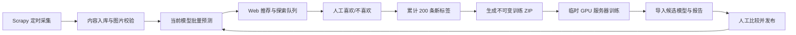

# 个人偏好内容筛选与持续学习平台开发计划

## 1. 目标与边界

构建一个局域网内可由手机和电脑访问的个人内容筛选平台：爬虫持续采集，当前模型为内容打分，Web 端展示缩略图和链接供人工“喜欢/不喜欢”筛选；每累计 200 条新增明确标签后自动生成训练包，由用户手动上传到临时 GPU 服务器训练，导回候选模型后人工决定是否发布。



关键原则：

- 模型只用于排序、初筛和辅助标注，不能直接生成训练真值。
- 只有明确的“喜欢/不喜欢”作为训练标签；跳过、浏览、点击链接只记录行为统计。
- 模型不能自动替换线上版本；候选版本必须人工发布。
- 所有标签、数据快照、模型、阈值和评估指标必须可追溯与可回滚。
- 现有训练集和爬虫图片保留原地，平台只保存经校验的路径引用和自身缩略图缓存。

## 1.1 实施状态与交接说明（2026-07-11）

> 本节是当前仓库的真实状态，不是目标状态。后续开发者应以此为准，不能将“计划中”内容当作已完成。

### 进度更新（P0–P4 代码已落地，待你本地真权重/全量数据验收）

- **P0**：可重绑 SQLite、`domain/*`、Alembic 初始迁移、入库合约 `created/duplicate/prediction_job_id`、标签历史/撤销、Idempotency-Key、CSRF、候选 ZIP 安全校验、pytest 套件。
- **P1**：`python -m platform_app.migrate_legacy --dry-run|--apply`。
- **P2**：`caoliuSpider` 稳定 `content_key`、图片校验后入库、`PlatformIngestPipeline`。
- **P3**：`predict_from_paths`、`ModelManager`、worker 批量 claim、skip 冷却、reject/rollback、发布 soft gate。
- **P4**：训练 ZIP 含 `split_manifest`/`SHA256SUMS`、`train.py --package`、`pack_candidate.py`、达阈值自动 `export_training_snapshot` job。
- **P5**：`frontend/` Vite+React+TS+Tailwind 已实现 login/review/library/labels/training/models/crawler/settings；生产构建 `frontend/dist` 由 FastAPI 同源托管。
- **仍未做（P6）**：运维脚本全集、真 BERT/ResNet 权重端到端、Windows 服务化、爬虫 Task Scheduler。
- 验证：`python -m pytest --basetemp=.pytest_tmp/run --tb=line` → **17 passed**；`cd frontend && npm run build` 通过。

### 已实现，位于 `platform_app/`

| 能力 | 当前实现 | 验证情况 | 限制 |
| --- | --- | --- | --- |
| SQLite 数据库 | SQLAlchemy 2 模型，SQLite WAL、外键和 busy timeout；首次启动时 `Base.metadata.create_all()` 建表。 | API 冒烟测试通过。 | 尚未配置 Alembic 迁移；生产使用前必须补迁移。 |
| 管理员会话 | 首次 `/api/v1/auth/setup` 创建唯一管理员，Argon2 密码哈希；登录后使用 30 天 HttpOnly、SameSite=Strict Cookie。 | setup、login、logout、session 冒烟通过。 | 无 CSRF、登录限流、HTTPS/secure cookie、密码重置和正式用户管理。 |
| 爬虫入库 API | `POST /api/v1/ingest/content` 接收稳定内容键、标题、磁力链接和 1-5 个图片绝对路径；校验媒体路径在允许根目录内，并创建 `predict` job。 | 通过本地临时图片测试。 | 现有 `caoliuSpider` 尚未调用该接口；未校验图片可解码、尺寸、哈希或质量。 |
| 内容与媒体模型 | `content_items`、`media_assets`、`view_events`、`predictions`、`jobs` 已实现。 | 入库、读取、媒体 URL、任务创建冒烟通过。 | 没有缩略图缓存、媒体一致性扫描、全文检索、归档或分页 cursor。 |
| 人工标注 | `POST /api/v1/contents/{id}/label` 写不可变 `label_events`，并更新 `current_label`；已标注内容被待筛选队列排除。 | 喜欢/不喜欢和队列排除冒烟通过。 | 尚无撤销 API、标签历史查询 API、跨设备冲突处理、CSRF/idempotency key。 |
| 待筛选 API | `GET /api/v1/feed` 支持 `mixed/score/uncertain/newest/random`；mixed 按约 80% 高分、20% 不确定/随机混合。 | 基础队列冒烟通过。 | 不是 SQL 高性能查询；不会应用 7 天 skip 冷却；没有真实模型分数时按 0.5 排序。 |
| 模型版本 | 可登记候选/active 模型，`POST /api/v1/models/{id}/activate` 切换 active。 | 模型登记和激活冒烟通过。 | 激活前未做真实模型加载/推理健康检查；无回滚、审计和发布二次确认。 |
| 预测 worker | `python -m platform_app.worker` 从数据库领取 `predict` 任务，读取 active 模型并保存预测。 | 代码可编译，未在真实 BERT/ResNet 权重与真实图片上端到端验证。 | 当前一次只处理一条 job，不是计划中的批量推理；图片目录假设过强；需重构为按 batch 批量 tensor 推理。 |
| 训练快照 ZIP | 从已标注内容生成 `manifest.csv`、固定哈希 split、原图和配置 ZIP；支持下载。 | 两正负样本 ZIP 内容冒烟通过。 | 未实现“每 200 新标签自动生成”；未保留数据集3为固定外部测试；远端 `train.py --package` 仍不存在。 |
| 候选模型导回 | ZIP 上传后检查路径穿越、`best_model.pth`、报告 JSON、checkpoint `model_state_dict`，登记 candidate，并提供 basic comparison。 | 使用临时 checkpoint 包冒烟通过。 | 无 ZIP 大小限制、签名、完整哈希清单验证、真实加载测试、指标门禁和模型回滚。 |
| 文档 | `platform_app/README.md` 写有启动、管理员、媒体根、入库、worker、训练包、候选导入说明。 | 人工检查。 | 根 README 未整合平台启动流程。 |

### 已修改但尚未提交

- `.gitignore`：忽略 `platform_data/` 和 `.env`。
- `requirements.txt`：新增 SQLAlchemy、Alembic、pwdlib[argon2]、pydantic-settings。
- `PRODUCT.md`：已记录沉浸、克制、视觉优先的产品上下文。
- `platform_app/`：后端原型源码和后端 README。

当前 `git status` 中上述文件均为未提交改动或未跟踪文件。接手前请先检查、测试、分阶段提交；不要假定已有 commit。

### 已执行的验证

以下命令和临时测试曾成功执行，所有生成的 `platform_data/` 测试数据库、图片、模型和 ZIP 均已清理：

```powershell
python -m compileall -q platform_app
python -m pytest -q tests\test_evaluation.py
```

- 已有测试：`2 passed`。
- 临时 API 冒烟：管理员 setup/login/logout、受保护 feed、入库、标签、view event、模型登记/激活。
- 临时训练快照：生成并下载 ZIP，确认存在 `manifest.csv`、`config.json`、`README_TRAINING.md`。
- 临时候选导入：确认 ZIP 可导入并返回 candidate comparison。

这些是开发时的手工冒烟，不是已提交的自动化平台测试。下一个开发者必须把它们固化为 pytest 测试。

### 未实现，不能对外宣称可用

- **前端完全未创建**：没有 `frontend/`、没有 React/Vite/TypeScript、没有浏览/标注/内容库/训练/模型页面。
- **爬虫未改造**：`C:\Users\mysta\Documents\caoliuSpider` 仍是原先 CSV + 图片目录流程，未稳定去重、未调用入库 API、未在图片完成后落库。
- **没有实际端到端推理**：缺少可访问的 BERT/ResNet 权重和真实 worker 验证；当前 worker 不是批量实现。
- **没有远程训练兼容**：当前 `train.py` 未读取平台 ZIP、未接受固定 split manifest、未生成符合候选导入规范的完整包。
- **没有模型发布安全门禁**：没有外部测试 hash 比对、指标阈值、真实 smoke inference、回滚和审计。
- **没有数据库迁移、备份、Windows 服务脚本、Task Scheduler、日志轮转、健康 worker 心跳或媒体扫描。**
- **没有真正的磁力下载器集成**：后端保存 `magnet_uri`，但 UI、复制、`magnet:` 协议打开和下载状态均未实现。
- **没有内容库全量搜索、筛选、统计、错误案例浏览、标签修改历史或移动端体验。**

### 前端设计状态

已完成产品上下文与高保真方向稿探索，但没有写入前端代码。已确认的信息：

- 完整平台优先，浅色界面，先做可交互原型。
- 沉浸式内容浏览，参考站酷式内容策展感。
- 待筛选是模型选出的 80% 推荐 + 20% 探索；内容库显示全量内容。
- 磁力链接必须是一级操作：显示链接摘要、复制链接、通过 `magnet:` 交给本地下载器。
- 所有明确喜欢/不喜欢标签保存为历史；跳过只保存行为，不作为负训练标签。

UI 的正式实现当时被设计流程的“界面 brief 显式确认”门槛暂停；继续开发时可直接采用以上约束，不需要重新讨论产品方向。

## 2. 技术架构与仓库职责

### 常驻 Windows 平台

- 前端：React、TypeScript、Vite、React Router、TanStack Query、Tailwind CSS。
- 后端：FastAPI、Pydantic、SQLAlchemy 2、Alembic。
- 数据库：SQLite，启用 WAL、外键和 busy timeout。
- 异步任务：独立 Python worker，通过数据库任务表领取任务；第一版不引入 Redis/Celery。
- 文件：原始图片保持在现有数据集/爬虫目录；平台管理缩略图缓存、模型、训练包、候选包、日志和备份。
- 访问：FastAPI 同源托管前端构建产物，局域网通过 `http://主机IP:8080` 访问。

### 两仓库职责

- `caoliuSpider`：采集、稳定去重、下载和校验图片，调用平台入库 API；不负责标签、训练或模型发布。
- `caoliu_deeplearning`：保留模型训练/预测代码，并新增平台后端、worker、前端、数据库迁移、训练包和模型管理能力。

## 3. 数据模型

### 核心表

| 表 | 关键字段与用途 |
| --- | --- |
| `users` | 单管理员账户，保存用户名、Argon2 密码哈希、状态和登录时间。 |
| `content_items` | 内容 UUID、稳定 `content_key`、来源 URL、原始/清洗标题、磁力链接、infohash、状态、当前标签、内容组。 |
| `media_assets` | 内容关联的原图路径、缩略图路径、序号、格式、尺寸、哈希、状态。 |
| `label_events` | 不可变人工标签事件；每次改标新增事件而不覆盖旧记录。 |
| `view_events` | 浏览、跳过、复制/打开链接等行为统计，不进入训练集。 |
| `predictions` | 内容、模型版本、概率、阈值、预测标签、时间。 |
| `model_versions` | candidate/active/archived/rejected 状态、文件哈希、指标、数据版本、阈值、温度。 |
| `training_snapshots` | 训练快照、标签截止时间、样本统计、manifest 哈希、训练包路径和状态。 |
| `jobs` | predict、export_package、generate_thumbnail、reconcile_media 等后台任务。 |
| `crawl_runs` | 每次爬虫运行的页数、发现/去重/下载成功失败数量和日志摘要。 |

### 内容唯一性和分组

1. 有 BT infohash 时，`content_key` 使用小写 infohash。
2. 没有 infohash 时，使用规范化帖子 URL 的 SHA-256。
3. 相同 `content_key` 再次采集只更新可变元数据，不创建新内容。
4. `content_group_id` 用于训练切分；相同 infohash、下载链接或规范化标题属于同组，永不跨 split。

### 标签与行为

- `label_events.label` 仅为 `0` 或 `1`，来源固定为 `explicit_web`。
- 修改标签时写入新事件及 `supersedes_event_id`；`content_items.current_label` 缓存最新值。
- `skip` 只生成行为事件，设置 7 天推荐冷却期，不产生负标签。
- 每个标签事件记录当时模型版本和概率，供后续分析模型误导情况。

## 4. 爬虫改造

### 流程

1. 列表页提取帖子 URL 和列表标题。
2. 详情页保留 `title_raw`，再生成 `title_clean`。
3. 提取磁力链接和标准化 infohash。
4. 收集图片候选，过滤广告、头像、表情和重复 URL。
5. 生成稳定 `content_key`，不再依赖递增 `video_01` 编号。
6. 下载最多 5 张有效图片。
7. 下载完成并验证至少一张有效图片后，调用平台入库 API。
8. 后端返回内容 ID，爬虫记录入库/去重结果。

### 图片质量与安全

- 图片最小尺寸为 `224×224`；必须可由 Pillow 解码。
- 过滤零字节、超小文件和极端长宽比图片。
- 用 SHA-256 删除完全相同图片；GIF 生成第一帧缩略图。
- 恢复全局 OffsiteMiddleware；媒体请求使用显式 `allow_offsite`。
- 没有有效图片的内容进入失败记录，不能进入正式队列。

### 调度

- Windows Task Scheduler 每 30 分钟运行一次增量抓取，默认扫描最新 4 页。
- 开启 AutoThrottle，单域并发 1。
- 每次运行幂等，重复执行不会重复入库。
- 连续失败仅记录和退避，不无限快速重试。

### 爬虫入库 API

`POST /api/v1/ingest/content` 接收：

- `content_key`、`source_url`、`title_raw`、`title_clean`
- `magnet_uri`、`info_hash`、`crawl_time`
- `media_paths`

后端校验 API key、内容键、允许媒体根目录、图片存在性、图片元数据和重复状态。成功入库后返回 `content_id`、`created`、`duplicate` 和 `prediction_job_id`。

## 5. 推理服务与推荐队列

### 推理 worker

- worker 启动时加载数据库中 active 模型，模型常驻内存。
- 每 5 秒领取最多 32 条预测任务，使用真正张量批处理。
- 保存校准概率、阈值、预测标签、模型版本、耗时和失败原因。
- 新模型发布后当前批次结束再热加载；加载失败时保留旧模型并记录告警。
- 没有 active 模型时内容仍可浏览，但显示“待预测”。

### 默认待筛选队列

每批 20 条未明确标注内容：

- 16 条高分推荐。
- 2 条最接近当前阈值的不确定内容。
- 2 条从其他未标注分数区间随机抽取的探索内容。

已标注内容排除；跳过内容在 7 天内排除；同一内容组只出现一次。支持高分、最不确定、最新、纯随机四种模式，分页使用 cursor。

## 6. Web 前端

### 路由

- `/login`：单管理员登录。
- `/review`：待筛选队列。
- `/library`：内容库与筛选。
- `/labels`：标签历史与统计。
- `/training`：训练快照、候选模型和发布。
- `/models`：模型版本、评估和回滚。
- `/crawler`：抓取状态、日志和手动执行。
- `/settings`：根目录、爬虫、推荐、备份和安全设置。

### 待筛选页

- 响应式卡片/专注模式，支持 1～5 张图片轮播。
- 显示标题、来源时间、模型概率、阈值、模型版本，以及打开来源、复制/打开磁力链接操作。
- 桌面快捷键：`1` 喜欢、`2` 不喜欢、`3` 跳过、`←/→` 切换图片、`M` 复制磁力、`Z` 撤销。
- 移动端使用底部固定按钮；滑动只切图，不直接标注，避免误触。
- 提交后立即显示下一条，并提供撤销提示。

### 内容库和统计

- 按标签、分数、模型版本、来源、抓取时间、查看状态筛选。
- 支持查看全部、喜欢、不喜欢、未标注、跳过冷却、媒体缺失和归档内容。
- 修改标签显示完整历史事件和所有模型预测历史。
- 标注页展示正负比例、新增标签数、高置信误判、阈值附近样本、模型纠正率。

### 训练与模型页面

- 显示距离下一训练包还差多少明确标签。
- 展示每个训练包的样本数、类别比例、重复/缺失过滤数、manifest 哈希和下载按钮。
- 支持上传候选模型包、对比 active/candidate 指标、查看错误集合、发布、拒绝和回滚。
- 训练图必须正确显示 PR-AUC，不能再将其错误标成 Validation Accuracy。

## 7. 后端公开接口

### 鉴权

- `POST /api/v1/auth/login`
- `POST /api/v1/auth/logout`
- `GET /api/v1/auth/session`

### 内容、推荐与媒体

- `GET /api/v1/feed?mode=mixed&limit=20&cursor=...`
- `GET /api/v1/contents`
- `GET /api/v1/contents/{id}`
- `GET /api/v1/contents/{id}/media/{media_id}`
- `POST /api/v1/contents/{id}/archive`

### 标签和事件

- `POST /api/v1/contents/{id}/label`，请求 `{ "label": 0|1 }`
- `POST /api/v1/contents/{id}/skip`
- `POST /api/v1/contents/{id}/events`
- `POST /api/v1/labels/{event_id}/undo`
- `GET /api/v1/labels/history`

所有写接口支持 idempotency key，防止多设备或弱网络重复提交。

### 训练、模型与任务

- `GET/POST /api/v1/training/snapshots`
- `GET /api/v1/training/snapshots/{id}/download`
- `POST /api/v1/training/candidates/import`
- `GET /api/v1/training/candidates/{id}/comparison`
- `GET /api/v1/models`
- `POST /api/v1/models/{id}/activate`
- `POST /api/v1/models/{id}/reject`
- `POST /api/v1/models/{id}/rollback`
- `GET /api/v1/crawls`
- `POST /api/v1/crawls/run`
- `GET /api/v1/jobs`
- `POST /api/v1/jobs/{id}/retry`

现有单条、批量、上传和 URL 预测接口保留兼容，但统一到 `/api/v1/predict` 前缀并增加鉴权。

## 8. 训练快照与临时 GPU 服务器

### Split 规则

- 现有数据集3永久作为固定外部测试集。
- 新 Web 明确标签首次写入时按 `content_group_id` 哈希固定分配：80% train、10% validation、10% production shadow test。
- 同一内容组永远属于同一 split。
- 阈值与温度只能在 validation 上选择；固定测试和 shadow test 只用于最终报告。

### 自动快照

- 从上一次已发布模型后累计 200 条新增明确标签时，自动创建不可变训练快照。
- 快照创建后新增标签进入下一批；可手动重新生成新快照，但旧快照不覆盖。
- ZIP 包总是包含完整有效训练数据，不只是新增 200 条。

训练包命名：`training_snapshot_<snapshot_id>_<manifest_hash>.zip`。

内容：

```text
manifest.csv
split_manifest.csv
config.json
images/
README_TRAINING.md
SHA256SUMS.json
```

远程训练脚本需支持 `--package`、`--run-id`、`--output-dir` 和传入 split 清单，禁止远端重新随机切分。

### 候选模型包

候选包命名：`candidate_<run_id>.zip`，包含：

- `best_model.pth`
- `evaluation_report.json`
- `training_history.json`、`training_history.png`
- 验证集/外部测试集预测与错误集合 CSV
- `model_manifest.json`
- `SHA256SUMS.json`

导入时检查内部哈希、checkpoint 格式、数据/测试 manifest 哈希、必需指标、模型安全加载和一次推理烟雾测试。

### 发布规则

硬性阻止发布：包损坏、模型不能加载、测试集哈希不一致、缺少报告、NaN/Inf 输出、推理失败。

软警告但允许人工覆盖：候选 PR-AUC 比 active 低超过 `0.02`、precision/recall 明显下降、未达到 90% precision、Brier score 变差、固定测试和 shadow test 趋势相反。

发布时事务切换 active 模型，worker 热加载；失败自动保持/回滚旧模型。旧预测保留，新内容使用新模型，未标注内容可单独触发重新预测。

## 9. 安全、运维和备份

- 默认仅局域网访问；Windows Firewall 只开放 Private Network 的 8080 端口。
- 移除当前 CORS 通配符，使用同源前端。
- 密码使用 Argon2；会话使用 HttpOnly、SameSite=Strict Cookie；所有状态修改接口校验 CSRF。
- 登录限速；不提供公开注册。
- 媒体通过数据库 ID 提供，禁止用户指定任意本地路径；所有路径限制在配置的允许根目录。
- 磁力链接只允许 `magnet:` 协议；爬虫使用独立 ingest API key。
- `.env`、数据库、模型、训练包不进入 Git；日志不记录密码、Cookie 或完整密钥。
- 每日备份 SQLite，保留 30 份；模型和训练快照永久版本化。
- 因为媒体原地引用，平台备份不等于原图备份；设置页明确提示媒体路径风险。
- 提供 `start-platform.ps1`、`stop-platform.ps1`、`status-platform.ps1`、`run-crawler.ps1`、`backup-platform.ps1`。
- 健康检查：`/health/live`、`/health/ready`、`/health/worker`。
- 日志按后端、worker、爬虫分开，10 MB 轮转并保留 10 份。
- 每晚执行媒体一致性扫描；缺失媒体不进推荐/训练包，恢复后自动重新启用。

## 10. 现有数据迁移

### Dry run

扫描数据集1～5及爬虫下载目录，输出缺失图片、重复链接、重复标题、标签冲突、无标签和无效标签报告，不修改文件。

### 正式导入

- 图片保留原地路径。
- 现有 `label=0/1` 导入为 `historical_import` 标签事件。
- 未标注爬虫内容进入待筛选队列。
- 数据集3标记固定外部测试集。
- 重复内容合并到同一内容组；冲突标签进入人工复核。
- 现有 `best_model.pth` 导入为首个 active 模型。
- 导入脚本幂等，可重复运行且不产生重复记录。

## 11. 实施阶段

1. **平台基础**：建立 FastAPI、SQLite/Alembic、登录、前端壳、配置、原地媒体路径安全访问、数据 dry run/导入。
2. **爬虫入库**：稳定 ID、图片校验、下载完成后入库、入库 API、去重、运行记录和 Task Scheduler。
3. **推理闭环**：worker、批量预测、active 模型热加载、80/20 队列、失败重试。
4. **Web 标注体验**：待筛选、快捷键、移动端、内容库、标签历史、统计、撤销和跳过冷却。
5. **训练生命周期**：200 标签快照、ZIP 导出、远程训练参数、候选包导入、指标比较、发布和回滚。
6. **加固与运维**：备份、恢复、日志轮转、健康检查、媒体一致性、性能/安全测试和完整文档。

## 12. 测试与验收

### 测试

- 单元：内容键/分组、路径校验、标签撤销、队列比例、冷却、split 稳定、ZIP 校验、任务租约、模型状态机。
- 集成：爬虫幂等入库、图片失败隔离、自动预测任务、多设备并发标注、快照生成、候选发布和回滚、模型热加载。
- 端到端：登录、桌面快捷键、手机标注、重复点击幂等、撤销、训练包下载、候选上传和发布二次确认。
- 性能：10 万内容记录的索引查询、32 条批量推理、SQLite 并发读写、训练包生成期间继续标注、worker 中断恢复。

### 验收标准

- 手机和电脑均可在局域网登录、浏览和标注。
- 重复爬取不产生重复内容或图片记录。
- 现有数据集和图片不被迁移程序修改。
- 只有明确喜欢/不喜欢进入训练 manifest。
- 推荐队列保持约 80% 推荐、20% 探索。
- 200 条新增标签后自动生成可下载训练包。
- 候选模型可导回、比较、人工发布并可回滚。
- 新模型发布后 worker 无需重启即可使用新版本。
- 任意标签、模型和训练结果都能追溯到数据/时间/版本。
- UI 中 PR-AUC、准确率、precision、recall 等指标名称正确。

## 13. 已锁定假设

- 平台常驻 Windows 主机，局域网多设备访问。
- 第一版仅一个管理员用户。
- Web 只展示缩略图、标题、来源与磁力链接，不下载或播放视频。
- 保留爬虫和训练两个仓库，通过 API 集成。
- 使用 React、FastAPI、SQLite/WAL、独立 worker；不引入 Redis、Celery、PostgreSQL。
- 媒体文件原地引用，平台只管理缩略图缓存。
- 只有明确喜欢/不喜欢作为训练标签。
- 推荐队列采用 80% 推荐、20% 探索。
- 每 200 条新增明确标签自动生成训练 ZIP。
- GPU 服务器临时手动租用，训练包和候选包以 ZIP 手动传输。
- 候选模型必须人工确认发布，不自动替换 active 模型。

## 14. 交接后的详细实施顺序

本节替代“按感觉继续开发”。每个阶段完成前必须有相应的自动化测试和运行证据；不能仅凭接口能启动就标记完成。

### P0：先稳定当前后端原型

1. 为 `platform_app` 增加独立 pytest 文件和临时数据库 fixture。
   - 每个测试使用 `tmp_path` 下的 SQLite 文件和图片文件，不能写入项目实际 `platform_data/`。
   - 覆盖 setup/login/logout、未登录 401、入库重复、非法媒体路径、标签改写历史、feed 排除已标注、模型切换、训练 ZIP、候选 ZIP 路径穿越。
2. 引入 Alembic。
   - 初始化 migration 环境。
   - 将当前 `Base.metadata.create_all()` 仅保留给测试/开发，生产启动改为执行已升级的 migration。
   - 为现有模型建第一份初始 migration；未来 schema 修改不得依赖删除数据库。
3. 修复和完善当前 API 合约。
   - 入库响应要明确返回 `created`、`duplicate`、`content_id`、`prediction_job_id`。
   - 所有写接口接收 `Idempotency-Key`，在数据库保存键、请求摘要和响应，重复请求返回第一次响应。
   - `label_events` 增加 user id，并实现标签历史查询、撤销和恢复当前标签。
   - 给 `/contents` 和 `/feed` 加 cursor 分页、稳定排序和输入长度限制。
4. 安全加固。
   - 启动时要求 `.env` 中配置管理员初始密码或仅开放一次性 bootstrap token。
   - 添加 CSRF token 验证、登录失败限流、session 单设备/多设备策略、`secure` cookie 的生产开关。
   - 对 candidate upload 设置大小、文件数、解压后总大小上限；检查 `SHA256SUMS.json`。
   - 所有 `magnet_uri` 仅接受 `magnet:`，所有媒体路径按 allowlist 和真实文件扩展名校验。

**P0 验收：** `pytest` 覆盖 API 成功和失败分支；重新启动应用不会丢数据；迁移可从空库升级到最新；上传恶意 ZIP 和非法路径返回 4xx 而不写入项目外文件。

### P1：现有训练数据与平台数据库迁移

1. 创建 `platform_app/migrate_legacy.py`，支持 `--dry-run` 和 `--apply`。
2. 读取数据集1至5的 `index.csv`，验证每条记录的文件夹、图片、标题、`download_link` 和 label。
3. 将 label `0/1` 导入成 `historical_import` 标签事件；无标签记录只入库不入训练。
4. 以 infohash 优先、下载链接其次、规范化标题兜底生成 `content_key/content_group_id`。
5. 数据集3写入 `dataset_role=external_test`，永远不加入 train/validation；为模型报告保留其固定 hash。
6. 输出 dry run CSV：缺图、重复、冲突标签、无标签、无效标签、同组跨数据集记录。
7. 迁移脚本必须幂等，第二次运行不重复创建内容、标签或媒体。

**P1 验收：** dry run 与 apply 后的统计可对上；所有现有图片仍留原位置；数据库数据量、正负标签数、冲突数有可复核报告；重复运行不改变数量。

### P2：改造 `caoliuSpider`

> 该仓库在本轮没有被写入。接手开发者需要在 `C:\Users\mysta\Documents\caoliuSpider` 实施以下工作。

1. 替换 `CaoliuIndexPipeline`。
   - 删除基于 `video_01` 的 ID 生成和图片下载前 CSV 追加。
   - 从 infohash 生成稳定内容键；没有 infohash 时使用 canonical URL hash。
   - 保存 `source_url/title_raw/title_clean/magnet_uri/info_hash/image_urls`。
2. 图片 pipeline 完成后才入库。
   - 验证可解码、最小 224×224、文件大小和长宽比。
   - 计算 SHA-256；去掉完全重复图片；最多保留 5 张。
   - 无有效图片时记录失败而不请求平台入库。
3. 新增 platform ingest client。
   - 从环境读取 `PLATFORM_API_URL` 与 `INGEST_API_KEY`。
   - 发送 JSON 和成功下载图片绝对路径。
   - 处理 201、重复、401、网络失败和重试；日志写 crawl run 摘要。
4. Scrapy 设置。
   - 开启 AutoThrottle；保留单域低并发。
   - 恢复 OffsiteMiddleware，外部图片请求仅使用显式 allow-offsite。
   - 配置重试、超时和 HTTP 缓存的开发模式。
5. Windows Task Scheduler 脚本。
   - 每 30 分钟触发一轮最新页采集。
   - 使用锁文件或平台 crawl job，避免并发重复运行。

**P2 验收：** 对同一页面重复运行两次，平台只保留一条内容；图片失败不会生成可推荐内容；爬虫运行统计可在 API/页面查看；已下载图片自动出现在平台内容库。

### P3：重构推理 worker 与模型发布

1. 实现 `ModelManager`。
   - 只加载 active 模型一次，记录版本、阈值、温度和加载状态。
   - 发布模型时先在独立进程/线程进行健康检查，再原子切换 active；失败继续使用旧模型。
2. 将 worker 改成真正批量推理。
   - 一次领取 16 至 32 个 predict jobs。
   - 按图片数量 padding，批量调用模型，而不是循环 `Predictor.predict()`。
   - 按内容的每张媒体明确构建 tensor，不能依赖“第一张图片所在目录内恰好只有该内容图片”的假设。
3. 实现任务 lease、worker 心跳、重试退避和失败分类。
4. 实现 skip 冷却和行为追踪。
   - skip 事件后 7 天从默认 feed 排除，但内容库仍可见。
   - 复制/打开磁力、浏览仅进入 analytics，不影响 `current_label`。
5. 实现正式发布门禁。
   - candidate 导入后真实加载 checkpoint 并对固定 fixture 做一次推理。
   - 比较 active/candidate 的外部测试 hash、PR-AUC、precision、recall、F0.5、Brier score。
   - PR-AUC 下降超过 0.02、测试 hash 缺失、阈值异常等给出阻断或人工覆盖确认。
   - 支持一键回滚到任意 archived 模型。

**P3 验收：** 真实 checkpoint 与真实图片端到端入队、预测、展示分数成功；重新发布模型不重启 Web；worker 崩溃后未完成 job 可重新领取；旧模型可回滚并继续预测。

### P4：训练包与远程 GPU 训练兼容

1. 修改 `train.py` 支持：
   - `--package <zip>`：解压到临时目录，读取 manifest 和图片。
   - `--split-manifest`：使用包内固定 split，不随机 `train_test_split`。
   - `--output-dir`、`--run-id`：产物输出到候选目录。
   - 禁止训练集接触 `external_test` 和 `production_shadow_test`。
2. 固化当前训练改造：正确的 ResNet layer4 解冻、BERT 最后两层、校准温度、阈值、错误集合和 `evaluation_report.json`。
3. 编写 `pack_candidate.py`。
   - 生成 `candidate_<run_id>.zip`，内含 checkpoint、报告、训练历史、预测 CSV、错误集合、`model_manifest.json` 和 SHA256 清单。
4. 自动训练触发。
   - 新增 200 条明确标签时创建 `export_training_snapshot` job，状态变为 `ready`。
   - 因 GPU 是临时手动租用，平台只自动创建包和通知，不自动租机或发布。
5. 导入后在平台展示 active/candidate 对比、误判样本与发布/拒绝操作。

**P4 验收：** 同一训练 ZIP 在不同机器运行得到同一 split manifest；候选包可导回平台并通过完整性验证；训练脚本不再随机改变数据划分；数据集3从不进入训练梯度。

### P5：实现 React 可交互前端

> 这是最主要的未完成部分。产品方向已确定，直接按以下规格实现，无需再次询问颜色和信息架构。

#### 技术与启动

1. 在 `caoliu_deeplearning/frontend/` 创建 Vite + React + TypeScript。
2. 使用 React Router、TanStack Query、Tailwind CSS、Lucide 图标。
3. 开发期 Vite proxy `/api` 到 FastAPI 8080；生产期 `npm run build` 输出由 FastAPI 静态托管。
4. 提供 `.env.example`、`npm run dev`、`npm run build`、`npm run lint`。

#### 视觉系统

- 浅色、暖白背景、深墨文字、低饱和青绿色作为选择/导航状态、克制朱红表示喜欢操作。
- 页面是作品浏览台，不是密集后台；避免渐变、玻璃拟态、巨型 KPI 卡、无意义动画。
- 左侧窄导航，中央大图，磁力链接和标注动作处于图片下方一级位置。
- 系统字体优先，固定字号层级，键盘焦点清晰；支持 `prefers-reduced-motion`。

#### 必须实现的路由

| 路由 | 数据源 | 关键行为 |
| --- | --- | --- |
| `/login` | auth API | 首次 setup、登录、失败状态。 |
| `/review` | `/feed`、label/event API | 大图轮播、缩略图、标题、分数、复制磁力、`magnet:` 打开、喜欢/不喜欢/跳过、撤销、键盘快捷键。 |
| `/library` | `/contents` | **全量**内容，不受模型筛选限制；筛选标签、状态、来源、日期和分数。 |
| `/labels` | label history/statistics API | 显示标签历史、可修改/撤销、误判和待复核列表。 |
| `/training` | training/status/snapshots/candidates API | 200 标签进度、下载 ZIP、上传 candidate、对比报告、发布/拒绝。 |
| `/models` | models API | active/candidate/archived、指标、错误集合、回滚。 |
| `/crawler` | crawl runs/jobs API | 最近运行、失败原因、手动抓取。 |
| `/settings` | settings API | 媒体根、爬虫周期、探索比例、备份状态。 |

#### Review 页精确行为

1. 默认请求 `GET /api/v1/feed?mode=mixed&limit=20`。
2. 清楚显示“推荐队列：80% 推荐 / 20% 探索”；不能把该队列误称为全量内容。
3. 每条内容显示 1-5 张图片、标题、来源、模型概率、阈值和模型版本。
4. 磁力链接区必须显示：链接摘要、复制按钮、`下载器打开`按钮。后者执行 `window.location.href = magnetUri`；失败显示“请确认已安装并关联磁力下载器”。
5. 标注按钮：喜欢、 不喜欢、跳过。喜欢/不喜欢调用 label API，跳过调用 event API。显示 5 秒撤销 toast。
6. 键盘：`1` 喜欢、`2` 不喜欢、`3` 跳过、`M` 复制磁力、`Z` 撤销、左右箭头切图；输入框聚焦时禁止快捷键。
7. 手机端：底部大按钮、水平滑动图片、不通过滑动直接提交标签。
8. 所有状态：加载 skeleton、空队列、预测等待、图片缺失、网络错误、磁力打开失败、长标题、无磁力链接。

#### 前端验收

- 桌面 1440px、平板 1024px、手机 390px 截图检查，无溢出或 hover-only 操作。
- Web 键盘标注可用，手机触控目标至少 44px。
- library 与 review 明确区分“全量”和“挑选队列”。
- 所有 API 错误均有可理解提示，不能静默失败。
- 真实 API 请求携带 cookie，未登录自动跳转 login。

### P6：运行、备份和交付

1. 提供 Windows PowerShell 脚本：启动/停止平台、启动 worker、运行爬虫、备份数据库、恢复数据库、构建前端。
2. 提供 Task Scheduler XML 或脚本，设置爬虫每 30 分钟运行和每日备份。
3. 添加 `/health/live`、`/health/ready`、`/health/worker`；worker 定时写心跳。
4. 实现媒体一致性扫描、日志轮转和数据库备份保留 30 天。
5. 更新根 README，覆盖完整平台启动顺序、环境变量、局域网访问、GPU 训练包往返、故障处理与安全提醒。
6. 仅在所有 API、worker、爬虫、前端和训练回流真实端到端验证后，才允许宣称“完整平台完成”。

## 15. 当前接手命令

```powershell
cd C:\Users\mysta\Documents\caoliu_deeplearning
python -m pip install -r requirements.txt
python -m uvicorn platform_app.main:app --host 0.0.0.0 --port 8080 --reload
```

然后执行首次管理员初始化，命令见 `platform_app/README.md`。启动前不要复制或创建测试 `platform_data/`；首次真实启动会自动创建空数据库。
